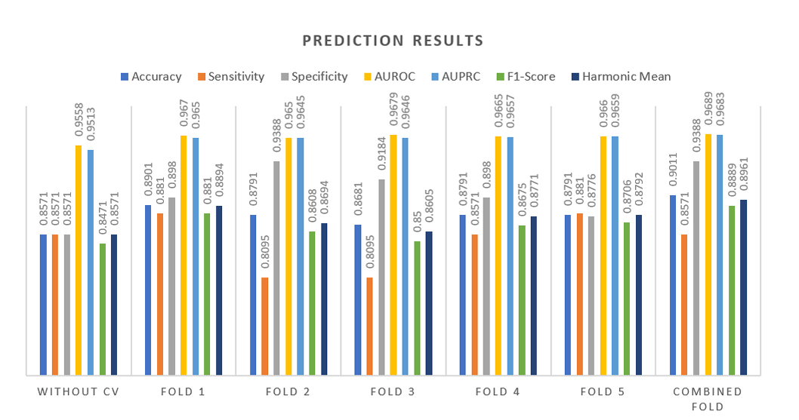

# Triplex-Forming Potential Prediction in Long Non-coding RNAs using Convolutional and Long Short Term Memory Networks
Long non-coding RNAs (lncRNAs), longer than 200 nucleotides, play key roles in gene regulation by forming DNA:RNA triplexes through Hoogsteen base pairing with purine rich regions of dsDNA. Experimental methods like NMR, CD spectroscopy, and EMSA are expensive and sensitive to conditions, highlighting the need for computational pre-screening. We propose a cascaded deep learning model combining 1D CNN and LSTM to classify triplex-forming lncRNAs, capturing both local and long-range dependencies. The model is trained on a benchmark dataset and evaluated using accuracy, sensitivity, specificity, AUROC, AUPRC, F1-score, and harmonic mean. 

With 5-fold cross-validation, it achieved 90.11% accuracy, 85.71% sensitivity, 93.88% specificity, 0.9689 AUROC, 0.9683 AUPRC,0.8889 F1-score, and 0.8961 harmonic mean, demonstrating strong generalization. This approach enables effective identification of triplex-forming lncRNAs, advancing our understanding of their roles in gene regulation and disease.

# Model Architecture

# Results

