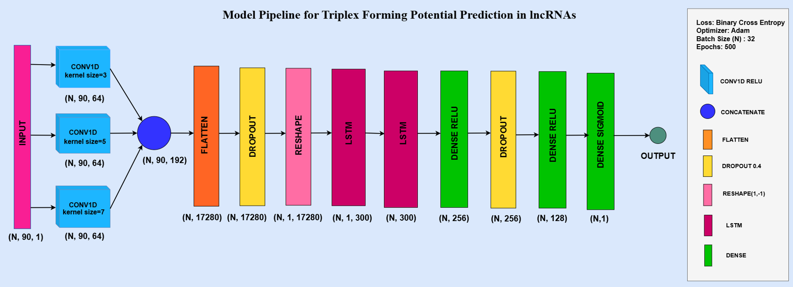

# Triplex-Forming-Potential-Prediction-in-lncRNA-using-CNN-LSTM
This Repository Presents a Deep Learning Model That Uses a Cascaded CNN LSTM Architecture to Predict the Triplex-Forming Potential of Long Noncoding RNA Sequences by Capturing Both Local Patterns and Long Range Dependencies.

